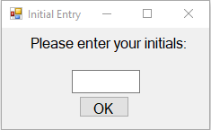
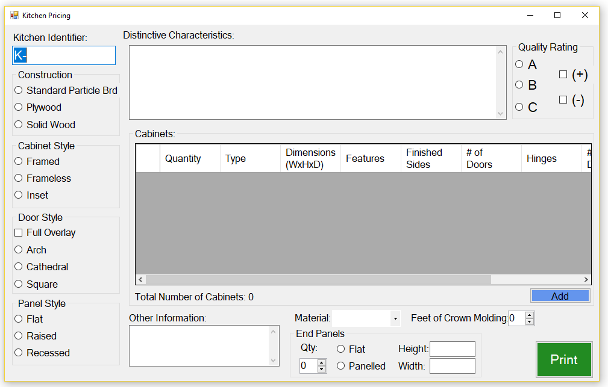
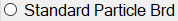
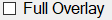
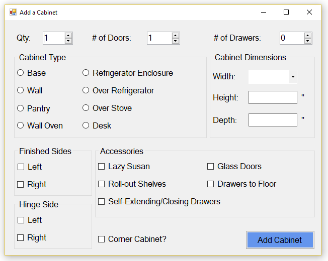
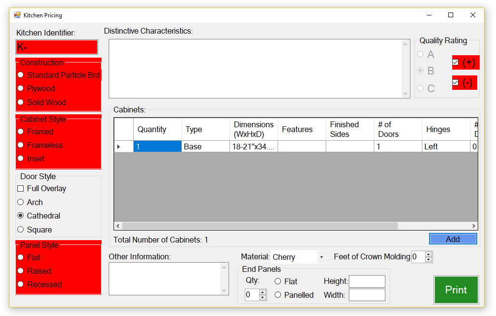

# Kitchen Pricing Application
##### Preface
This application is made for quickly assessing the value of a secondhand kitchen.  The pricing is based on the size of the individual cabinets, features of the cabinets, material used in construction, and the condition of the kitchen as a whole.  A detailed breakdown of the pricing is provided in the Pricing section.
My hope is that the application provides a fluid kitchen pricing experience, albeit with jarring safeguards, that relieves the computing workload.
This software, as it is currently released, is free to use.  I hope that it will increase productivity for anyone that needs it!

This application is a Windows Forms Application that has an interface that can be utilized via mouse or keyboard controls (Tab, Shift, Arrow Keys, Space, and Enter).

## Installation
Requirements: Windows OS, 7 or later.
			  Printer - connnected to the Windows OS or the location that you save the files from the Windows OS.
1. Download the "Ready to Launch.zip" file from this GitHub repository and unzip it to some location on the computer that will be used for kitchen pricing.  This location will be where all the kitchen pricing files will be saved.
2. (Optional) Create a shortcut on the desktop by the following:
	1. Navigating to and opening the "Ready to Launch" folder.
	2. Left-clicking once on "Kitchen Pricing Application", it may look like "Kitchen Pricing Application.exe" (if you see both, choose the one that has Type "Application"), and then right-clicking on the application.
	3. Left-clicking on "Send To" in the menu, then left-clicking on "Desktop (create shortcut)".

	OR
	
	1. Go to the Desktop.
	2. Right-click on the Desktop.
	3. Left-click on "New", then left-click on "Shortcut".
	4. Left-click the "Browse" button in the pop-up window and navigate to the "Ready to Launch" folder.
	5. Left-click on "Kitchen Pricing Application", it may look like "Kitchen Pricing Application.exe" (if you see both, choose the one that has Type "Application"), and left-click "OK".
	6. Left-click on the "Next" button in the bottom right of the pop-up window.
	7. Enter a name for the shortcut.
	8. Left-click the "Finish" button.

3. Replace the "logo.png" file with the logo of your organization.  **Note:** Your logo must be in a PNG file format and be named "logo".  The logo should also span only up to 65% of paper you will print on.

Now we should be ready to use!

## Functionality
##### Opening the Application

Upon double-left-clicking on the application or application shortcut, the user (you) will be prompted to enter your initials.  Your initials will be displayed on the pricing sheet associated with the kitchens.

The subsequent screen is the Kitchen Pricing Main Screen.  

##### Kitchen Pricing Main Screen
This screen has selections of characteristics that apply to the kitchen as a whole.  

The Kitchen Identifier has the format "K-##...#Y" where Y is a year code letter following the pattern: 2018=G, 2019=H, 2020=I, 2021=J, etc.
Each kitchen should have a different identifier distinguished by the numeral places of the kitchen identifier.
	Example: K-0G would be the first kitchen priced in 2018
		 K-1000G would be the 1001st kitchen priced in 2018

**Note:** If there is already a kitchen with the same identifier, the old kitchen will be overwritten with a new one.

Each kitchen attribute (Construction, Cabinet Style , Door Style, Panel Style, and Quality Rating) is outlined by a gray box.  The boxes contain the options for each attribute.
- white circle buttons: only one per group can be selected.  Thay are officailly called radio buttons.
		
- white square buttons: any number of these can be selected per group.  They are officailly called check boxes.
		

**Note:** The kitchen Quality Rating can only be selected once per kitchen and the options will be disabled.  The Quality Rating must be chosen before any cabinets can be added.

"Distinctive Characteristics" and "Other Information" are sections where the user can enter appropriate text.  Distinctive Characteristics has a character limit of 200 characters for the sake of the kitchen price listing template.  Other Information has a sufficiently high upper limit on number of characters.

In the lower-left there are points of entry for Material, End Panels, and Crown Molding.  Material is a dropdown menu of materials found in common kitchens.

The End Panels Height and Width text boxes accept measurements in inches, but only input the number.

##### Add a Cabinet Screen
The "Cabinets" section is table that displays all the entered cabinets and their properties.  
To add a cabinet, the user will click the "Add Cabinet" button, this will cause a popup of the "Cabinet Form".  **Note:** The Quality Rating must be chosen before a cabinet can be added.

Special Considerations for the Add Cabinet sections:
- Qty - the number of identical cabinets in the kitchen that the cabinet entry concerns
- Width - dropdown menu of ranges, choose the range that includes the width of the cabinet in question
- Height - this field autofills if there is an industry standard measurement 
- Depth - this field autofills if there is an industry standard measurement
- Drawers to Floor - check this box if the cabinets drawers make up almost all of the the front of the cabinet.
- **Add Cabinet** - on click: the cabinet information is checked for completeness and contradiction.  When no error is found, the cabinet and its information will be entered into the table in the main screen.  If an error is found, the user will have to correct if before the cabinet can be accepted.

##### Printing
The user can click the "Print" button when all relevant information has been entered.  If there is essential missing information or contradiction, the lacking sections will be highlighted in red and no files will be generated.  The user should correct the information before clicking "Print" again.

On clicking the print button, the application will generate a Cabinet Specifics Sheet, a Cabinet Specifics Sheet with cabinet pricing breakdown, and a kitchen price listing.  These documents will be saved as HTML files in the "Ready to Launch" folder. The kitchen price listing includes the adjustment for material, particle board construction, end panels, crown molding, and rating (+) or (-), however, the Cabinet Spec Sheet with pricing does not include this breakdown.  

The HTML files can be printed by opening them in a web browser:
1. Navigate to the "Ready to Launch" folder.
2. Double-left-click on the file to be printed.  This should open the file in an Internet Browser (firefox, chrome, IE, etc.).  If it does not: right-click the file, left-click "Open with", and then left-click on an internet browser from the list of applications.
3. Use Ctrl+P to bring up the print screen.  Alternatively, use the browser menus to navigate to the print screen.
4. Ensure that the print settings specify the correct printer and that 8.5"x11" paper will be used.
5. Click the print button in the browser.

The Cabinet Spec Sheet can be posted with the kitchen to give customers take-home details.  
The Cabinet Spec Sheet with cabinet pricing information is for the records of the organization listing the kitchen.  The information may be helpful if the kitchen will be sold as individual cabinets.
The kitchen price listing should be posted on the kitchen to advertize its price.  The price listing includes distinctive characteristics to guard against dishonest customers switching kitchen price listings.

## Pricing

The pricing of the kitchens is based off the quality of the kitchen, the function of the cabinets, size of the cabinets, the material of the cabinet fronts, the material of the cabinet interior,  presence of end panels, and presence of crown molding.
